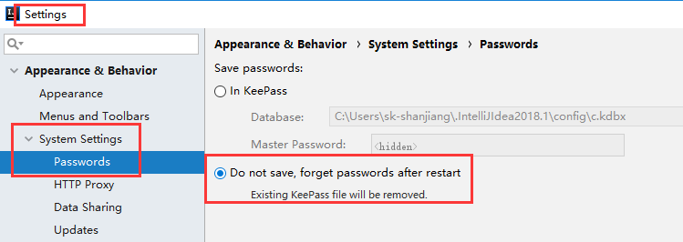
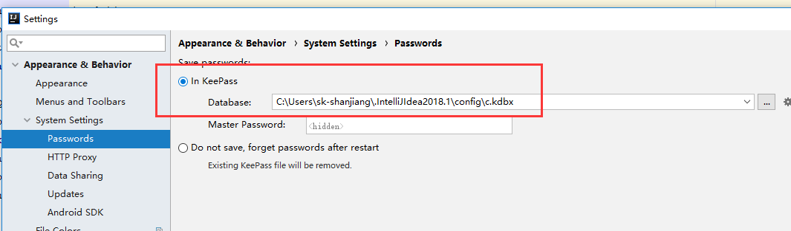
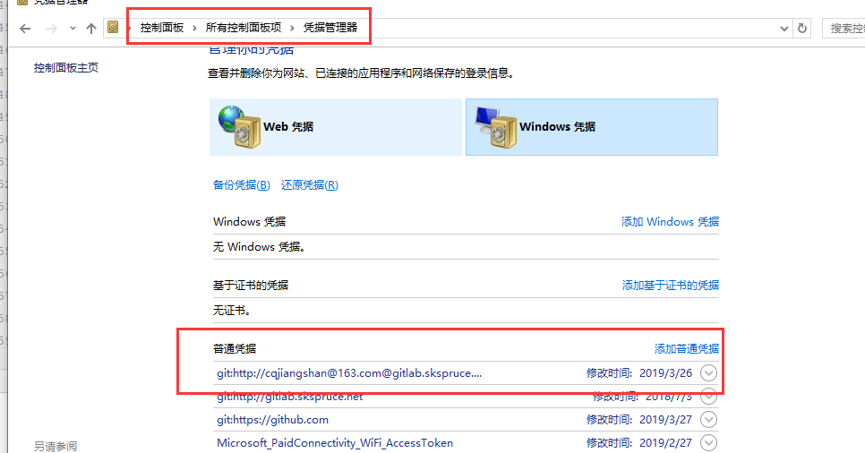

* 两种方式
    - [http方式](#http方式)
        采用http协议传输，需要设置用户名和密码
    - [ssh方式](#ssh方式)
        采用ssh协议传输，需要设置Keys

-----------------

# http方式

- **特点**

    要求project在创建的时候只能选择**Public**公开状态，Private和Internal私有模式下不能使用http方式进行连接（ssh方式在三种模式下都可以）
  
    使用http方式直接连接gitlab显然没有ssh连接方式安全，但是也可以做些安全设置，比如在gitlab本机的iptables里做**端口限制**(比如8081端口)、**添加白名单**等

- **配置**

    git相关UI工具可以直接**手动输入账号**或记住密码**免输入登录**

    + 手动输入账号设置（idea为例）
    
        
        
    + 免输入登录
   
        + In native Keychain:选择此选项以使用本机Keychain存储您的密码。此设置仅适用于MacOS和Linux。

        + In KeePass: 选择此选项以使用KeePass密码管理器来存储您的密码。在windows上是以windows凭据来设置与修改的（win10 idea为例）

        
        
　　　
# ssh方式
- **特点**

    比http方式更安全，支持三种模式（**public、private、internal**）

- **配置**

    打开git bush

    ssh-keygen -t rsa -C "email@email.com"

    ssh-agent -s

    ssh-agent bash

    ssh-add ~/.ssh/id_rsa

    vim ~/.ssh/id_rsa.pub，右键复制出现的内容,添加到git账户setting中的ssh keys

    详情参考：https://blog.csdn.net/suo_ivy/article/details/79940839
